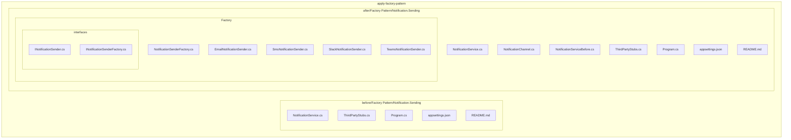
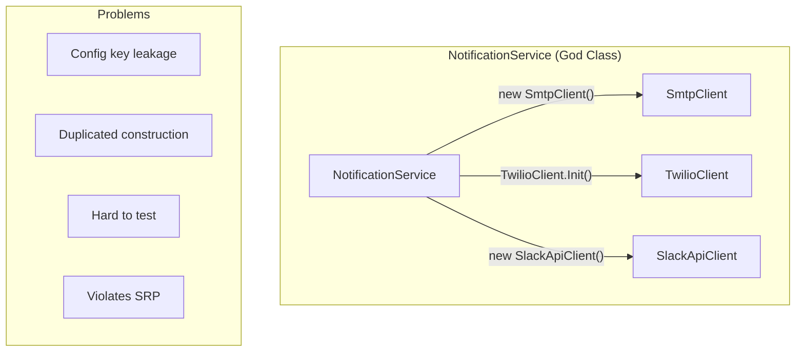
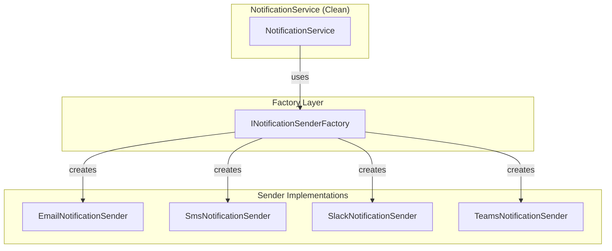
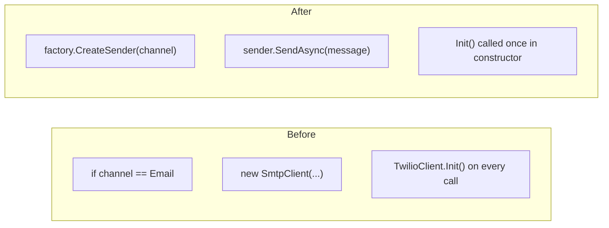
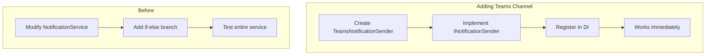
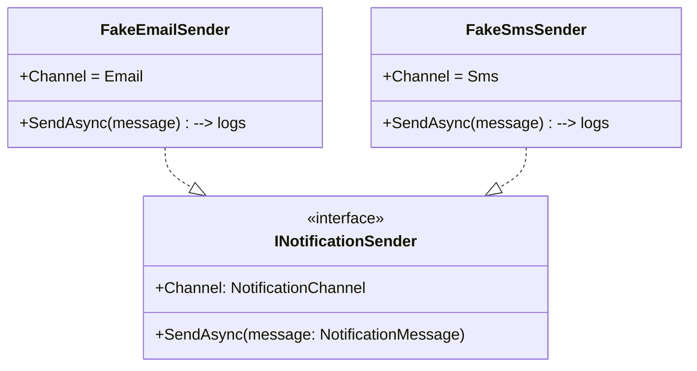
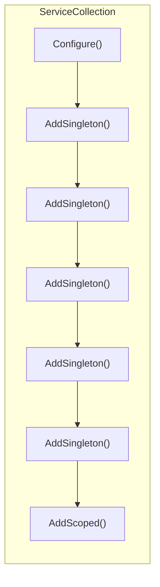

# Apply Factory Pattern

A demonstration project showcasing the **Factory Pattern** refactoring applied to a notification service. Compares the **before** (with code smells) and **after** (clean, maintainable) implementations.

---

## Table of Contents

- [Overview](#overview)
- [Project Structure](#project-structure)
- [The Problem: Code Smells](#the-problem-code-smells)
- [The Solution: Factory Pattern](#the-solution-factory-pattern)
- [Before vs After Comparison](#before-vs-after-comparison)
- [Why Factory Pattern is the Best Choice](#why-factory-pattern-is-the-best-choice)
- [Key Design Principles](#key-design-principles)
- [How to Run](#how-to-run)
- [Credits](#credits)

---

## Overview

This project demonstrates how the **Factory Pattern** solves common object creation and configuration problems in a notification service that supports multiple channels (Email, SMS, Slack, Teams).

### Before: NotificationService with Code Smells

- ❌ Construction in the wrong layer
- ❌ Config key leakage (magic strings)
- ❌ Duplicated construction logic
- ❌ Hard to test
- ❌ Violates Single Responsibility Principle
- ❌ Primitive obsession (string-based channels)
- ❌ Static side-effects

### After: Factory-Based Architecture

- ✅ Single Responsibility — each sender handles one channel
- ✅ Open/Closed — add new channels without modifying existing code
- ✅ Dependency Inversion — depends on abstractions
- ✅ Testable — easy to mock senders
- ✅ Type-safe — strongly-typed enum for channels
- ✅ No static side-effects — initialization at construction time

---

## Project Structure



---

## The Problem: Code Smells

### Before Architecture



### 8 Code Smells in the Before State

| # | Code Smell | Description |
|---|------------|-------------|
| 1 | **Construction in wrong layer** | `SmtpClient`, `TwilioClient`, `SlackApiClient` created inside service |
| 2 | **Config key leakage** | Magic strings like `"Smtp:Host"` scattered everywhere |
| 3 | **Duplicated construction** | SmtpClient setup copy-pasted in `SendAsync` and `SendBulkAsync` |
| 4 | **Hard to test** | No seam to replace SMTP with a fake |
| 5 | **Adding a channel = modifying service** | Every new channel requires changes to `NotificationService` |
| 6 | **Violates SRP** | Service knows how to send AND how to construct every client |
| 7 | **Primitive obsession** | Channel is `string`; typos like `"Emal"` compile fine |
| 8 | **Static side-effects** | `TwilioClient.Init()` called on every SMS send |

---

## The Solution: Factory Pattern

### After Architecture



### Key Improvements

| # | Improvement | How |
|---|--------------|-----|
| 1 | **Construction moved to factory** | Service asks factory for sender |
| 2 | **No config key leakage** | Typed `IOptions<T>` settings classes |
| 3 | **No duplication** | Each sender encapsulates its own construction |
| 4 | **Easy to test** | Mock `INotificationSender` interface |
| 5 | **Open/Closed** | Add new sender class, no service changes |
| 6 | **SRP compliant** | Service, senders, and factory have distinct responsibilities |
| 7 | **Type-safe channels** | `NotificationChannel` enum catches typos at compile time |
| 8 | **No static side-effects** | `TwilioClient.Init()` called once at construction |

---

## Before vs After Comparison

### Code Comparison



### Metrics Comparison

| Metric | Before | After |
|--------|--------|-------|
| **Cyclomatic Complexity** | High (branching on string) | Low (single factory call) |
| **Lines of Code (NotificationService)** | ~136 lines | ~25 lines |
| **Testability** | Difficult | Easy (mock interfaces) |
| **Extensibility** | Requires modification | Add new class |
| **Configuration** | Magic strings | Typed settings |

### Class Responsibilities

| Class | Before | After |
|-------|--------|-------|
| `NotificationService` | Sends + Constructs all clients | Sends only (orchestration) |
| `EmailNotificationSender` | N/A | Constructs + Sends Email |
| `SmsNotificationSender` | N/A | Constructs + Sends SMS |
| `SlackNotificationSender` | N/A | Constructs + Sends Slack |
| `TeamsNotificationSender` | N/A | Constructs + Sends Teams |
| `INotificationSenderFactory` | N/A | Creates senders |

---

## Why Factory Pattern is the Best Choice

### 1. Solves the Constructor Pollution Problem

The Factory Pattern **separates object creation from object use**. In the before state, `NotificationService` constructor took `IConfiguration` and had to know how to construct all clients. After refactoring:

```csharp
// Before: constructor polluted with config knowledge
public NotificationServiceBefore(IConfiguration config)
{
    _config = config; // Must pass config to build clients later
}

// After: constructor only needs what it uses directly
public NotificationService(INotificationSenderFactory factory)
{
    _factory = factory; // Asks factory for senders when needed
}
```

### 2. Enables Open/Closed Principle



**Before**: Adding a channel required modifying `NotificationService` (violates OCP)
**After**: Adding a channel only requires creating a new sender class (follows OCP)

### 3. Makes Testing Trivial



Replace any sender with a fake for unit testing — no network calls, no external dependencies.

### 4. Follows Dependency Inversion Principle

```mermaid
graph TB
    subgraph "Before"
        H[High-level: NotificationService]
        L[Low-level: SmtpClient, TwilioClient, SlackApiClient]
        H --> L
    end

    subgraph "After"
        HA[High-level: NotificationService]
        A[Abstraction: INotificationSender]
        L2[Low-level: EmailSender, SmsSender, ...]
        HA --> A
        A ..|> L2
    end
```

**Before**: High-level module depends on low-level modules
**After**: Both depend on abstractions

### 5. Why Not Other Patterns?

| Pattern | Verdict | Reason |
|---------|---------|--------|
| **Abstract Factory** | ❌ Overkill | We only need ONE factory interface, not families of related objects |
| **Builder** | ❌ Irrelevant | Builder helps with step-by-step construction of complex objects; our objects are simple |
| **Strategy** | ❌ Insufficient | Strategy provides interchangeable algorithms but doesn't solve object creation |
| **Service Locator** | ❌ Anti-pattern | Implicit dependency resolution makes testing harder |
| **Mediator** | ❌ Wrong problem | Doesn't address object creation complexity |

---

## Key Design Principles

### SOLID Principles Applied

| Principle | Before Violation | After Compliance |
|-----------|------------------|------------------|
| **S**ingle Responsibility | Service knows how to send AND construct | Each class has one reason to change |
| **O**pen/Closed | Adding channel = modify service | Add sender class, no modifications |
| **L**iskov Substitution | N/A | All senders substitutable via interface |
| **I**nterface Segregation | N/A | Small, focused `INotificationSender` interface |
| **D**ependency Inversion | Depends on concretions | Depends on `INotificationSender` abstraction |

### Dependency Injection Setup



---

## How to Run

### Before (with code smells)

```bash
cd "before/Factory Pattern/Notification.Sending"
dotnet restore
dotnet run
```

### After (with Factory Pattern)

```bash
cd "after/Factory Pattern/Notification.Sending"
dotnet restore
dotnet run
```

---

## Credits

This project accompanies a video demonstration of Factory Pattern refactoring, highlighting:

- 8 common code smells in object creation
- How Factory Pattern solves each problem
- Comparison with alternative patterns
- Real-world DI integration with .NET

---

## See Also

- [Before README](./before/Factory%20Pattern/README.md) — Detailed before-state documentation
- [After README](./after/Factory%20Pattern/Notification.Sending/README.md) — Detailed after-state documentation
