# Notification.Sending — After Factory Pattern Refactoring

This folder contains the **after** snapshot of the notification service, showcasing the **Factory Pattern** applied to eliminate code smells and improve maintainability.

---

## Table of Contents

- [Overview](#overview)
- [What Was Fixed](#what-was-fixed)
- [Architecture](#architecture)
- [Key Abstractions](#key-abstractions)
- [Implementation Details](#implementation-details)
- [Supported Channels](#supported-channels)
- [Class Diagram](#class-diagram)
- [Sequence Diagram: SendAsync](#sequence-diagram-sendasync)
- [How to Run](#how-to-run)
- [Design Decisions](#design-decisions)

---

## Overview

The refactored `NotificationService` delegates the creation of notification senders to a factory, achieving **loose coupling**, **testability**, and **extensibility**. Each channel has its own dedicated sender class that handles both configuration and sending logic.

### Before vs After

| Aspect | Before | After |
|--------|--------|-------|
| Client Creation | Inside `NotificationService` | Via `INotificationSenderFactory` |
| Channel Type | Plain `string` | Strongly-typed `NotificationChannel` enum |
| Adding a Channel | Modify `NotificationService` | Add new sender class, register it |
| Testing | Hard to mock | Easy via `INotificationSender` interface |
| Configuration | Magic strings scattered | Typed `IOptions<T>` settings classes |
| Static Side-Effects | `TwilioClient.Init()` on every call | Once at construction time |

---

## What Was Fixed

### 1. ✅ Construction Moved to Factory Layer

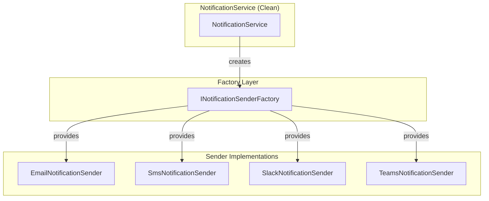

The service no longer instantiates clients directly. It asks the factory for the appropriate sender.

### 2. ✅ No More Config Key Leakage

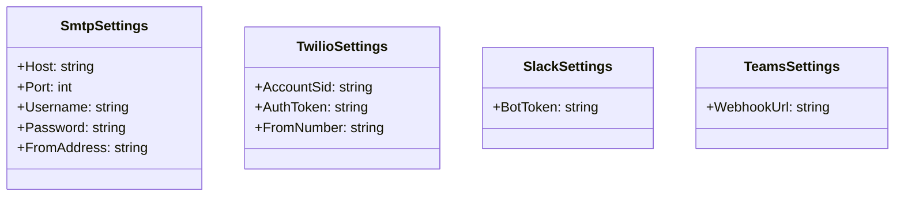

Configuration is bound to strongly-typed settings classes using `IOptions<T>`.

### 3. ✅ No More Duplicated Construction

Each sender encapsulates its own construction logic. The factory simply provides pre-built singletons.

### 4. ✅ Easy to Test

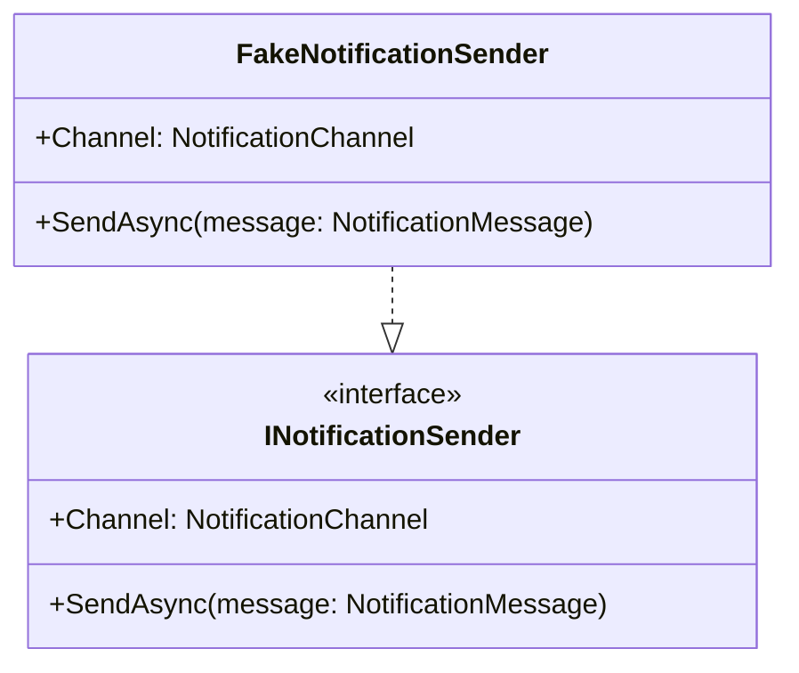

Replace any sender with a fake for unit testing.

### 5. ✅ Adding a Channel = New Class

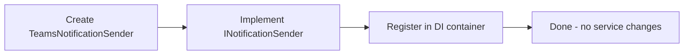

New channels don't require modifying `NotificationService`.

### 6. ✅ SRP Compliant

- `NotificationService` — orchestrates sending
- `INotificationSender` — knows how to send for ONE channel
- `INotificationSenderFactory` — knows how to create/fetch senders

### 7. ✅ No More Primitive Obsession

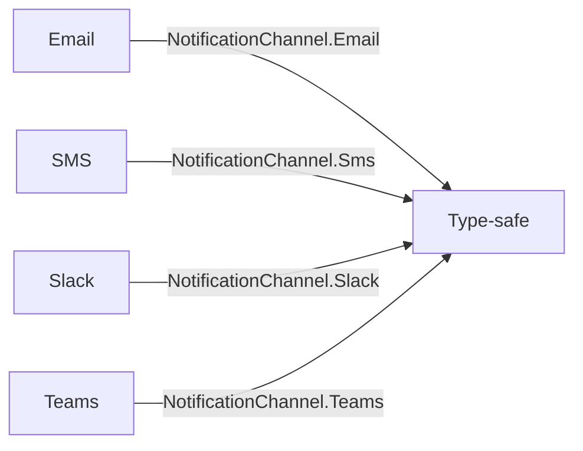

The `NotificationChannel` enum catches typos at compile time.

### 8. ✅ Static Side-Effects Eliminated

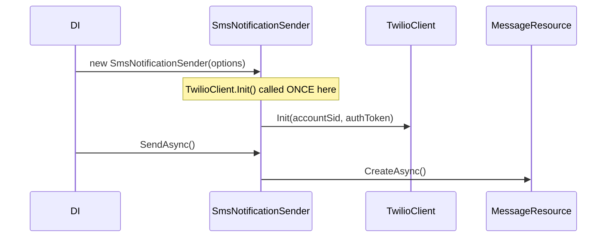

`TwilioClient.Init()` is called once when the singleton is constructed, not on every send.

---

## Architecture

### High-Level Structure

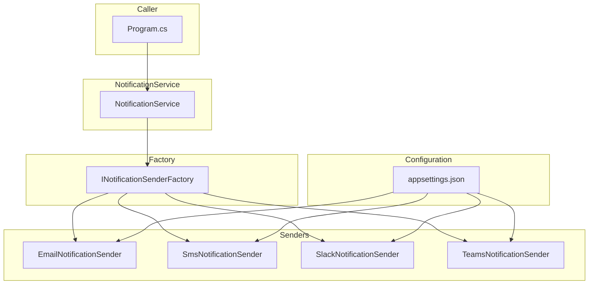

### Dependency Injection Setup

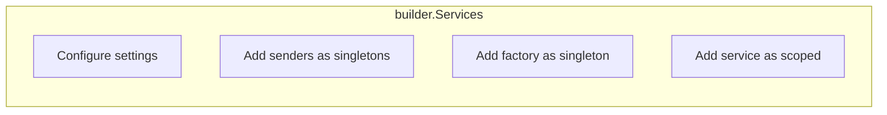

---

## Key Abstractions

### INotificationSender

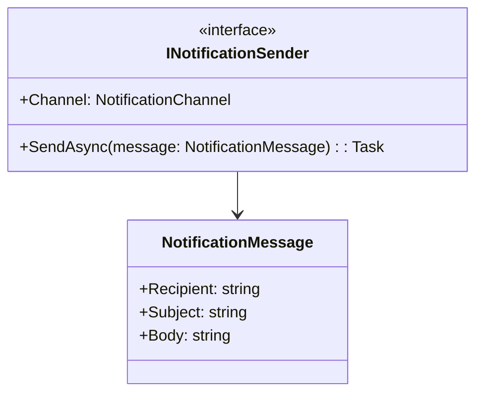

### INotificationSenderFactory

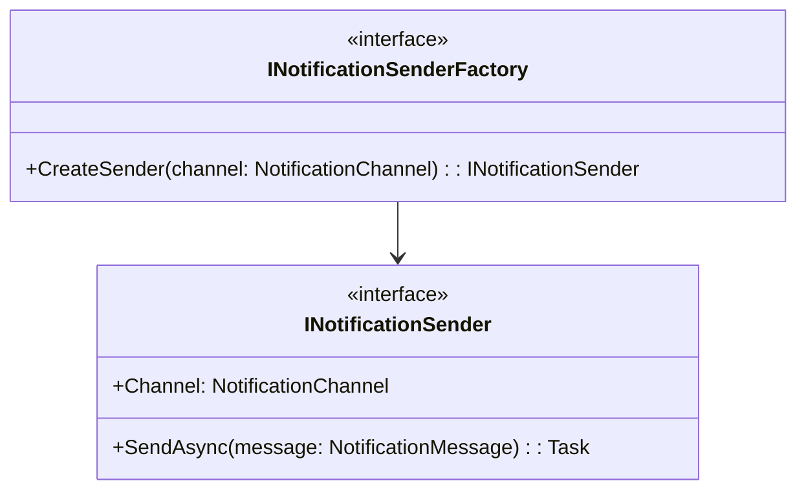

---

## Implementation Details

### NotificationSenderFactory

The default factory collects all registered senders and maps them by channel:

```csharp
internal sealed class NotificationSenderFactory : INotificationSenderFactory
{
    private readonly Dictionary<NotificationChannel, INotificationSender> _senders;

    public NotificationSenderFactory(IEnumerable<INotificationSender> senders)
    {
        _senders = senders.ToDictionary(s => s.Channel, s => s);
    }

    public INotificationSender CreateSender(NotificationChannel channel)
    {
        if (!_senders.TryGetValue(channel, out var sender))
        {
            throw new ArgumentOutOfRangeException(nameof(channel));
        }
        return sender;
    }
}
```

### KeyedNotificationSenderFactory (Alternative)

An alternative using .NET 8 keyed services:

```csharp
internal sealed class KeyedNotificationSenderFactory(IServiceProvider sp)
    : INotificationSenderFactory
{
    public INotificationSender CreateSender(NotificationChannel channel)
    {
        return sp.GetRequiredKeyedService<INotificationSender>(channel);
    }
}
```

---

## Supported Channels

| Channel | Sender Class | Settings Class |
|---------|--------------|----------------|
| **Email** | `EmailNotificationSender` | `SmtpSettings` |
| **SMS** | `SmsNotificationSender` | `TwilioSettings` |
| **Slack** | `SlackNotificationSender` | `SlackSettings` |
| **Teams** | `TeamsNotificationSender` | `TeamsSettings` |

---

## Class Diagram

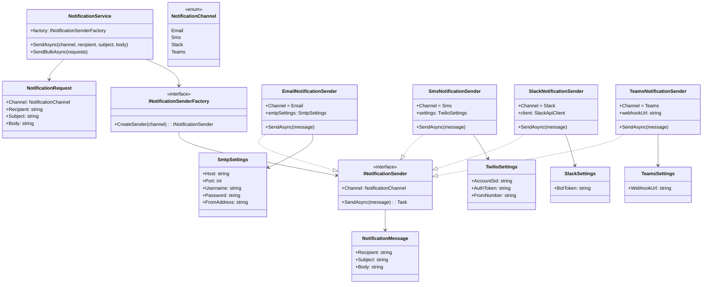

---

## Sequence Diagram: SendAsync

### Email Flow

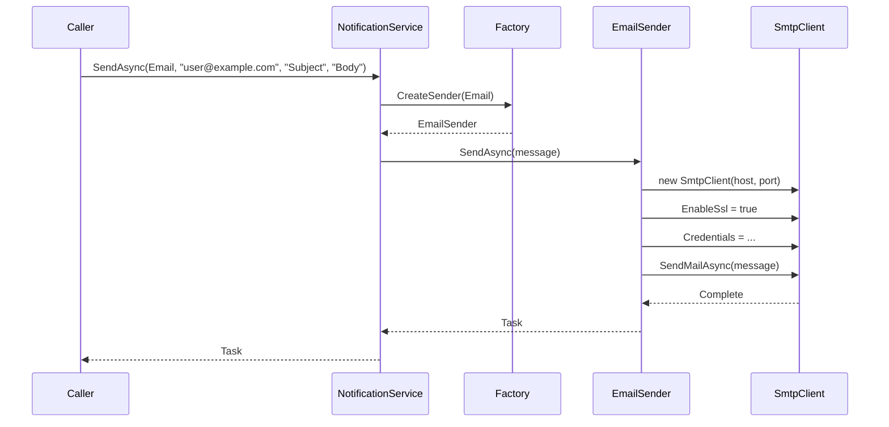

### SMS Flow

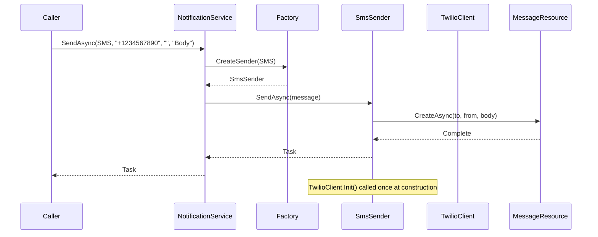

---

## How to Run

1. Navigate to the project directory:
   ```bash
   cd "after/Factory Pattern/Notification.Sending"
   ```

2. Restore dependencies:
   ```bash
   dotnet restore
   ```

3. Run the application:
   ```bash
   dotnet run
   ```

---

## Design Decisions

### Why Factory Pattern is the Best Approach Here

1. **Open/Closed Principle** — Add new channels without modifying existing code
2. **Single Responsibility** — Each sender handles one channel; service handles orchestration
3. **Dependency Inversion** — Service depends on abstractions (`INotificationSender`), not concretions
4. **Testability** — Easy to mock or stub any sender
5. **Extensibility** — New senders are discovered via DI, no central registration needed

### Why Not Other Patterns?

| Pattern | Why Not |
|---------|---------|
| **Strategy** | Each strategy would still need construction logic; factory handles creation |
| **Abstract Factory** | Overkill for this use case; one factory interface is sufficient |
| **Builder** | Used for complex object construction; not needed here |
| **Mediator** | Doesn't help with object creation |
| **Service Locator** | Anti-pattern; DI with factory is more explicit and testable |

---

## Files

| File | Description |
|------|-------------|
| `NotificationService.cs` | Refactored service using factory |
| `NotificationChannel.cs` | Strongly-typed enum for channels |
| `NotificationServiceBefore.cs` | Original service with code smells (for comparison) |
| `Factory/interfaces/INotificationSender.cs` | Sender abstraction |
| `Factory/interfaces/INotificationSenderFactory.cs` | Factory abstraction |
| `Factory/NotificationSenderFactory.cs` | Default factory implementation |
| `Factory/EmailNotificationSender.cs` | Email sender with SmtpSettings |
| `Factory/SmsNotificationSender.cs` | SMS sender with TwilioSettings |
| `Factory/SlackNotificationSender.cs` | Slack sender with SlackSettings |
| `Factory/TeamsNotificationSender.cs` | Teams sender with TeamsSettings |
| `ThirdPartyStubs.cs` | Stub implementations |
| `Program.cs` | Entry point with DI setup |
| `appsettings.json` | Configuration file |
